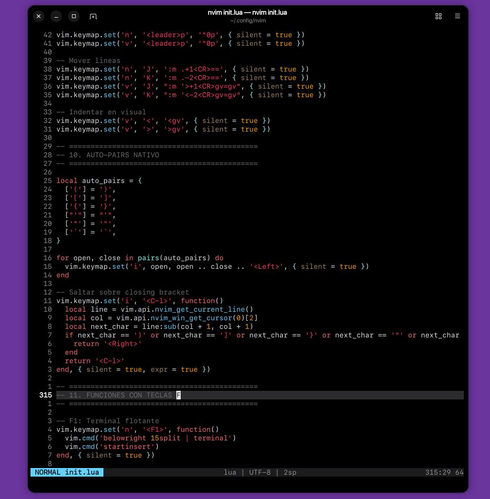

# Configuración Minimalista Neovim Estilo Apple (`init.lua` v3.1)

Una configuración de Neovim ultra ligera, diseñada para desarrolladores que buscan elegancia estética, velocidad nativa y cero sobrecarga de plugins. Integración de comandos mediante teclas de acceso rápido.

---

## Descripción Técnica y Características

* **Cero Dependencias Obligatorias**: Configuración 100% funcional desde el primer momento utilizando únicamente Lua nativo y las APIs internas de Neovim.
* **Barra de Estado Adaptativa**: Indicadores dinámicos de modo con detección nativa de ramas de Git, conteo de diagnósticos/LSP activos, codificación dinámica y progreso del cursor.
* **Cierre Automático y Navegación Nativa**: Emparejamiento inteligente de corchetes/comillas y salto de cursor mediante `<C-l>` sin necesidad de plugins pesados.
* **Integración Opcional**: Suite visual moderna integrada mediante [`mini.nvim`](https://github.com/echasnovski/mini.nvim) para búsqueda difusa (*fuzzy finding*), acciones sobre envolventes (*surround*) y guías de indentación.

---

## Requisitos y Compatibilidad

| Software | Versión Mínima | Nota |
| :--- | :--- | :--- |
| **Neovim** | `>= 0.8.0` | Requiere soporte nativo de la API de Lua (`vim.keymap`, `vim.diagnostic`) |
| **Terminal** | Color Verdadero (24-bit) | Requiere soporte para `termguicolors` para renderizar la paleta de Apple |
| **Git** | `>= 2.0` | Opcional, utilizado para la identificación de ramas en la barra de estado |

---

### Captura de pantalla:

